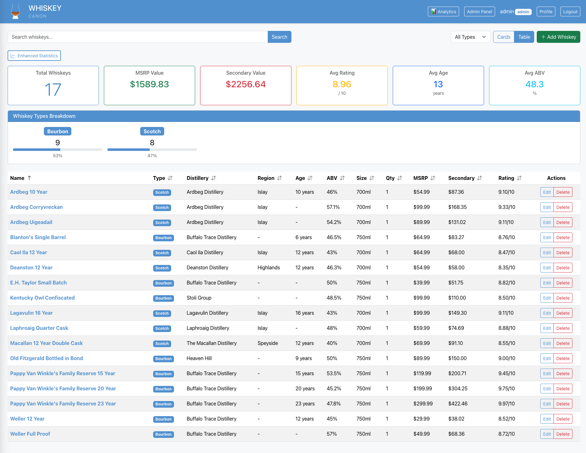
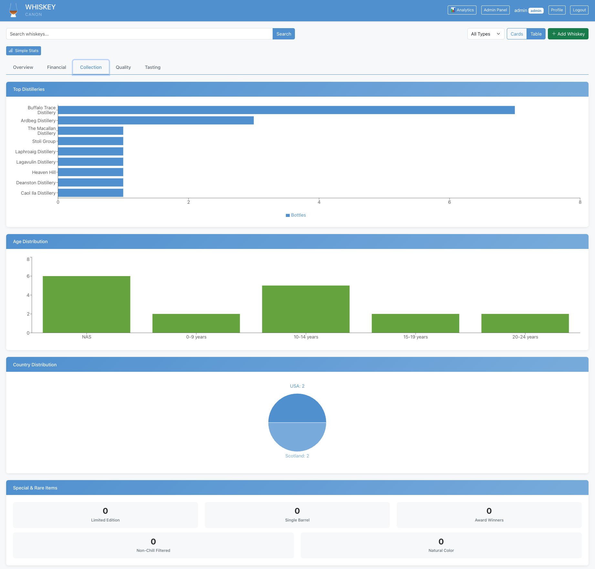
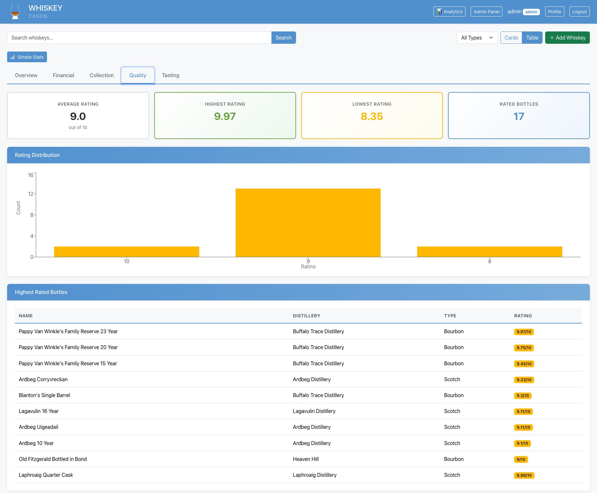
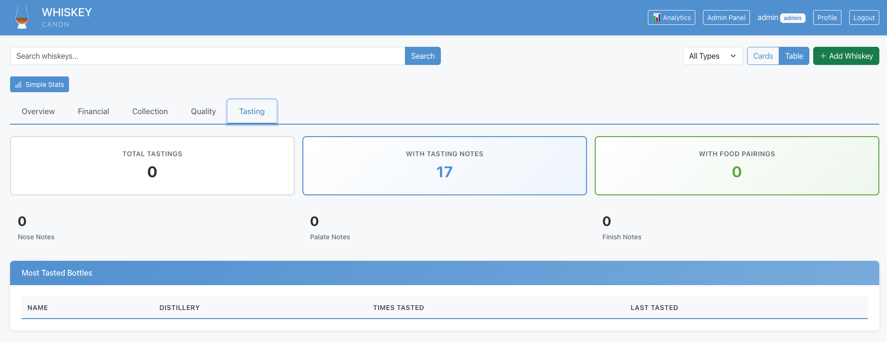

# Whiskey Canon

A comprehensive whiskey collection management application built with TypeScript, React, Express, and SQLite. Track your whiskey collection with detailed information, pricing, tasting notes, inventory management, and investment tracking.


## ✨ Features

### 📊 Analytics & Data Visualization (NEW!)
- **Interactive Analytics Dashboard** with 10+ charts powered by Recharts
- **Financial metrics**: Total value, ROI, gain/loss tracking
- **Visual insights**: Pie charts, bar charts, scatter plots for deep analysis
- **Performance tracking**: Best ROI bottles, most valuable items
- **Distribution analysis**: Type, age, rating, and distillery breakdowns
- **Database performance**: 10 optimized indexes for instant queries on large collections

### 🔐 Authentication & Authorization
- **Session-based authentication** with httpOnly cookies
- **Role-Based Access Control (RBAC)** with three roles:
  - **Admin**: Full access including user management
  - **Editor**: Create, read, and update whiskeys
  - **Viewer**: Read-only access
- **Private collections**: Each user has their own whiskey collection
- **Admin panel**: Manage users, change roles, view all collections

### 📊 Comprehensive Collection Management
- **8 whiskey types supported**: Bourbon, Scotch, Irish, Japanese, Rye, Tennessee, Canadian, Other
- **57 data fields** organized into 7 categories for detailed tracking
- **Tabbed form interface** for easy data entry without overwhelming users
- **Pre-populated data**: 30+ whiskeys with MSRP and secondary market prices

#### Data Categories

**1. Basic Information**
- Name, type, distillery, region, country
- Age, ABV, proof, size, rating
- Mash bill, awards
- Limited edition, chill filtered, natural color flags
- Description

**2. Purchase & Acquisition Tracking**
- Purchase date, price, and location
- Bottle code / batch number
- Quantity in collection
- MSRP and secondary market prices

**3. Inventory Management**
- Status (In Collection, Consumed, Sold, Gifted, Traded)
- Storage location
- Opened/sealed status
- Date opened
- Remaining volume percentage

**4. Production Details**
- Cask type and finish
- Barrel number (for single barrels)
- Bottle number (for limited editions)
- Vintage year (distillation year)
- Bottled date

**5. Enhanced Tasting Notes**
- Visual color description
- Nose/aroma notes
- Palate/taste notes
- Finish notes
- General tasting notes
- Times tasted and last tasted date
- Food pairings

**6. Investment & Value Tracking**
- Current market value
- Value gain/loss calculation
- Investment bottle flag
- Track ROI on your collection

**7. Visual Documentation & Social**
- Bottle image URLs
- Label image URLs
- Receipt/proof of purchase images
- For sale/trade flags
- Asking price
- Sharing history
- Private notes

### 💰 Pricing & Value Features
- **MSRP tracking** with pre-populated prices for popular bottles
- **Secondary market prices** based on 2025 market research
- **Purchase price tracking** to monitor your actual investment
- **Automatic value calculations** (MSRP Value = MSRP × quantity)
- **Investment tracking** with gain/loss monitoring

### 📈 Statistics Dashboard
Real-time collection statistics including:
- Total whiskey count
- Total MSRP value
- Total secondary market value
- Average rating (out of 10)
- Average age (years)
- Average ABV (%)
- **Type breakdown** with visual percentage bars showing distribution

### 📊 Advanced Analytics Dashboard (NEW!)
Comprehensive data visualization with interactive charts powered by Recharts:
- **Financial Overview**: Total value, ROI, gain/loss tracking
- **Collection Composition**: Pie charts for type distribution
- **Top 10 Most Valuable**: Bar chart of highest-value bottles
- **Rating Distribution**: Histogram of collection quality
- **Age Distribution**: Bar chart showing whiskey age ranges
- **Best ROI**: Investment performance tracking
- **Top Distilleries**: Most represented producers
- **Value by Type**: Total market value segmented by category
- **Inventory Status**: Opened vs unopened, bottles running low
- **Special Items**: Limited editions, single barrels, award winners
- **Tasting Stats**: Tracking tasting notes and sessions

### 🎨 Modern Bootstrap UI
- **Responsive design** works on mobile, tablet, and desktop
- **Bootstrap 5** for clean, professional styling
- **Dual view modes**:
  - **Table view**: Sortable columns, easy scanning (default)
  - **Card view**: Visual browsing with detailed cards
- **Detail modal**: Click any whiskey for complete information
- **Sortable columns**: Click headers to sort by any field
- **Color-coded**: Whiskey-themed blue (#5B9BD5)

### 👥 Admin Features
- **User management panel**
  - View all users
  - Change user roles
  - Delete users
- **Global collection view**
  - See all whiskeys from all users
  - Filter by specific user
  - Sort by any column
  - Track total collection statistics

### 🔍 Search & Filter
- Search by whiskey name
- Filter by whiskey type
- Filter by distillery
- Sort by name, type, rating, age, ABV, and more
- Admin: Filter collections by user

### 🎲 Demo Data & Data Quality
- **Comprehensive demo seed**: 6 diverse user profiles with 147 realistic whiskeys
- **Intelligent pricing**: Automatic secondary market value calculation based on characteristics
- **Rating standardization**: All ratings normalized to 2 decimal places
- **Duplicate detection**: Automatic identification and smart replacement of duplicate bottles
- **User-specific replacements**: Replacement bottles match user preferences and profiles
- **80+ replacement pool**: Extensive database of bourbon, scotch, Irish, Japanese, and rye whiskeys

## 🚀 Quick Start

### Prerequisites

- Node.js 18+ (LTS recommended)
- npm 9+

### Installation

```bash
# Clone the repository
git clone https://github.com/YOUR_USERNAME/whiskey-canon.git
cd whiskey-canon

# Install dependencies
npm install

# Initialize database with migrations
npm run db:migrate --workspace=backend

# Optional: Seed sample data
npm run db:seed --workspace=backend           # Bourbon data
npm run db:seed:scotch --workspace=backend    # Scotch data
npm run db:seed:irish --workspace=backend     # Irish whiskey data

# Optional: Populate pricing data
npm run db:update-msrp --workspace=backend       # Add MSRP prices
npm run db:update-secondary --workspace=backend  # Add secondary prices
npm run db:update-quantity --workspace=backend   # Set quantities to 1
npm run db:update-remaining --workspace=backend  # Update missing prices

# Optional: Create test users with collections
npm run db:seed:users --workspace=backend     # 4 basic test users

# Recommended: Create demo users with realistic collections
npm run seed:demo --workspace=backend         # 6 users with 10-40 whiskeys each (147 total)
```

### Development

```bash
# Run both frontend and backend in development mode
npm run dev

# Or run them separately:
npm run dev:backend    # Backend runs on http://localhost:3000
npm run dev:frontend   # Frontend runs on http://localhost:5173
```

Visit `http://localhost:5173` to view the application.

### Production Build

```bash
# Build both frontend and backend
npm run build --workspace=backend
npm run build --workspace=frontend

# Start production backend
npm start --workspace=backend
```

## 📁 Project Structure

```
whiskey-canon/
├── backend/                    # Express backend
│   ├── src/
│   │   ├── index.ts           # Server entry point
│   │   ├── routes/            # API routes
│   │   │   ├── auth.ts        # Authentication routes
│   │   │   ├── whiskeys.ts    # Whiskey CRUD routes
│   │   │   └── admin.ts       # Admin-only routes
│   │   ├── models/            # Data models
│   │   │   ├── User.ts        # User model & CRUD
│   │   │   └── Whiskey.ts     # Whiskey model & CRUD
│   │   ├── middleware/        # Express middleware
│   │   │   ├── auth.ts        # Authentication middleware
│   │   │   └── rbac.ts        # RBAC authorization
│   │   ├── types/             # TypeScript type definitions
│   │   │   └── index.ts       # Shared types & enums
│   │   ├── seed-demo.ts       # Demo data with 6 users & 147 whiskeys
│   │   └── utils/             # Utilities
│   │       ├── database.ts    # Database init & migrations
│   │       ├── seed.ts        # Bourbon data seeding
│   │       ├── seed-scotch.ts # Scotch data seeding
│   │       ├── seed-irish.ts  # Irish data seeding
│   │       ├── seed-users.ts  # Test user creation
│   │       ├── update-msrp.ts        # MSRP price updates
│   │       ├── update-secondary.ts   # Secondary price updates (DEPRECATED - use update-secondary-prices.ts)
│   │       ├── update-secondary-prices.ts # Intelligent secondary pricing
│   │       ├── update-ratings.ts     # Standardize ratings to 2 decimals
│   │       ├── update-quantity.ts    # Quantity updates
│   │       ├── update-remaining-prices.ts
│   │       ├── remove-duplicates.ts  # Remove duplicate bottles from collections
│   │       ├── add-indexes.ts        # Add database indexes for performance
│   │       └── add-bourbons.ts       # Add 23 premium bourbons to collection
│   └── whiskey.db             # SQLite database (auto-created)
│
├── frontend/                  # React frontend
│   ├── src/
│   │   ├── App.tsx           # Main app component
│   │   ├── main.tsx          # Entry point
│   │   ├── components/       # React components
│   │   │   ├── WhiskeyForm.tsx        # 7-tab whiskey form
│   │   │   ├── WhiskeyTable.tsx       # Sortable table view
│   │   │   ├── WhiskeyCard.tsx        # Card component
│   │   │   ├── WhiskeyStats.tsx       # Statistics dashboard
│   │   │   ├── WhiskeyDetailModal.tsx # Detail modal
│   │   │   └── PrivateRoute.tsx       # Protected routes
│   │   ├── pages/            # Page components
│   │   │   ├── LoginPage.tsx
│   │   │   ├── RegisterPage.tsx
│   │   │   ├── DashboardPage.tsx     # Main collection view
│   │   │   └── AdminPage.tsx         # Admin panel
│   │   ├── context/          # React context
│   │   │   └── AuthContext.tsx       # Auth state management
│   │   ├── services/         # API services
│   │   │   └── api.ts                # API client
│   │   └── types/            # TypeScript types
│   │       └── index.ts              # Frontend types
│   └── dist/                 # Production build output
│
├── DEPLOYMENT.md             # GCP Ubuntu deployment guide
├── package.json              # Workspace configuration
└── README.md                 # This file
```

## 🗃️ Database Schema

### Users Table
```sql
CREATE TABLE users (
  id INTEGER PRIMARY KEY AUTOINCREMENT,
  username TEXT UNIQUE NOT NULL,
  email TEXT UNIQUE NOT NULL,
  password TEXT NOT NULL,
  role TEXT NOT NULL CHECK(role IN ('admin', 'editor', 'viewer')),
  created_at DATETIME DEFAULT CURRENT_TIMESTAMP,
  updated_at DATETIME DEFAULT CURRENT_TIMESTAMP
);
```

### Whiskeys Table (57 columns)

**Core Fields:**
- `id`, `name`, `type`, `distillery`, `region`, `country`
- `age`, `abv`, `proof`, `size`, `quantity`
- `rating`, `description`, `tasting_notes`

**Purchase & Pricing:**
- `purchase_date`, `purchase_price`, `purchase_location`, `bottle_code`
- `msrp`, `secondary_price`

**Inventory:**
- `is_opened`, `date_opened`, `remaining_volume`, `storage_location`, `status`

**Production:**
- `cask_type`, `cask_finish`, `barrel_number`, `bottle_number`
- `vintage_year`, `bottled_date`

**Tasting:**
- `color`, `nose_notes`, `palate_notes`, `finish_notes`
- `times_tasted`, `last_tasted_date`, `food_pairings`

**Investment:**
- `current_market_value`, `value_gain_loss`, `is_investment_bottle`

**Metadata:**
- `mash_bill`, `awards`, `limited_edition`, `chill_filtered`, `natural_color`

**Media:**
- `image_url`, `label_image_url`, `receipt_image_url`

**Social:**
- `is_for_sale`, `asking_price`, `is_for_trade`, `shared_with`, `private_notes`

**System:**
- `created_by` (FOREIGN KEY → users.id)
- `created_at`, `updated_at`

## 🔧 API Endpoints

### Authentication
- `POST /api/auth/register` - Register new user
- `POST /api/auth/login` - Login
- `POST /api/auth/logout` - Logout
- `GET /api/auth/me` - Get current user

### Whiskeys (All require authentication)
- `GET /api/whiskeys` - Get all whiskeys (user's collection only)
- `GET /api/whiskeys/search?q=query` - Search user's whiskeys
- `GET /api/whiskeys/:id` - Get single whiskey (if owned by user)
- `POST /api/whiskeys` - Create whiskey (Editor+ permission)
- `PUT /api/whiskeys/:id` - Update whiskey (Editor+ permission, own whiskey only)
- `DELETE /api/whiskeys/:id` - Delete whiskey (Editor+ permission, own whiskey only)

### Admin (Require admin role)
- `GET /api/admin/users` - Get all users
- `GET /api/admin/whiskeys` - Get all whiskeys with owner information
- `PUT /api/admin/users/:id/role` - Update user role
- `DELETE /api/admin/users/:id` - Delete user

## 🎯 Default Test Users

### Basic Test Users (`npm run db:seed:users`)

| Username | Password | Role | Whiskeys |
|----------|----------|------|----------|
| alice_admin | password123 | Admin | 8 |
| bob_editor | password123 | Editor | 7 |
| charlie_viewer | password123 | Viewer | 8 |
| diana_editor | password123 | Editor | 6 |

### Demo Users with Realistic Collections (`npm run seed:demo`)

| Username | Password | Role | Whiskeys | Description |
|----------|----------|------|----------|-------------|
| bourbon_lover | demo123 | Editor | 26 | American whiskey enthusiast |
| scotch_fan | demo123 | Editor | 32 | Scotch specialist with diverse regions |
| curator | demo123 | Admin | 35 | High-end collector across all types |
| beginner | demo123 | Viewer | 13 | Entry-level affordable bottles |
| investor | demo123 | Editor | 24 | Investment-grade bottles (unopened) |
| admin | demo123 | Admin | 32 | Extensive bourbon collection with premium bottles |

**Total Demo Whiskeys**: 170 unique bottles with complete data (MSRP, secondary prices, ratings, etc.)

**⚠️ IMPORTANT**: Change these passwords in production!

## 🎯 Data Quality & Collection Management

### Intelligent Secondary Pricing
The `update-secondary-prices.ts` script automatically calculates secondary market values based on whiskey characteristics:

- **Limited Edition/Investment Bottles**: 1.5-2.0x MSRP
- **Aged 18+ Years**: 1.3-1.6x MSRP
- **Highly Rated (9.0+)**: 1.4-1.7x MSRP
- **12+ Years**: 1.2-1.4x MSRP
- **Well-Rated (8.5+)**: 1.2-1.4x MSRP
- **Budget (<$40)**: 1.05-1.2x MSRP
- **Standard Bottles**: 1.1-1.3x MSRP

This provides realistic market estimates for valuation and investment tracking.

### Rating Standardization
All ratings are automatically standardized to exactly 2 decimal places for consistency across the database.

### Duplicate Detection & Removal
The duplicate removal script:
- Identifies duplicate bottles in each user's collection (same name + distillery)
- Intelligently replaces duplicates based on user profile:
  - **bourbon_lover**: Gets bourbon/rye replacements
  - **scotch_fan**: Gets scotch/Irish replacements
  - **investor**: Gets high-value bottles (secondary >$100)
  - **beginner**: Gets affordable bottles (<$80)
  - **curator/admin**: Gets diverse mix across all types
- Prevents creating new duplicates during replacement
- Maintains collection size and user preferences

## 💻 Database Management Scripts

```bash
# Database Migration
npm run db:migrate --workspace=backend

# Seed Whiskey Data
npm run db:seed --workspace=backend           # 10 popular bourbons
npm run db:seed:scotch --workspace=backend    # 10 popular scotches
npm run db:seed:irish --workspace=backend     # 10 popular Irish whiskeys

# Create Demo Users (RECOMMENDED)
npm run seed:demo --workspace=backend         # 6 diverse users with 170 whiskeys

# Create Basic Test Users
npm run db:seed:users --workspace=backend     # 4 basic test users

# Data Quality Scripts
npx tsx src/utils/update-secondary-prices.ts  # Intelligent secondary pricing based on characteristics
npx tsx src/utils/update-ratings.ts           # Standardize ratings to 2 decimal places
npx tsx src/utils/remove-duplicates.ts        # Remove duplicate bottles from collections
npx tsx src/utils/add-indexes.ts              # Add database indexes for performance optimization
npx tsx src/utils/add-bourbons.ts             # Add 23 premium bourbons to admin collection

# Legacy Pricing Scripts
npm run db:update-msrp --workspace=backend       # Add MSRP prices (legacy)
npm run db:update-secondary --workspace=backend  # Add secondary market prices (legacy)
npm run db:update-quantity --workspace=backend   # Set all quantities to 1
npm run db:update-remaining --workspace=backend  # Fill in missing prices
```

## 🌐 Deployment

See **[DEPLOYMENT.md](./DEPLOYMENT.md)** for comprehensive deployment instructions to Google Cloud Platform (Ubuntu Server).

### Quick Deployment Overview:
1. **Create GCP VM** (Ubuntu 22.04 LTS, e2-small)
2. **Install dependencies** (Node.js via nvm, Git, SQLite3)
3. **Clone and build** the application
4. **Configure environment** variables
5. **Run with PM2** for process management
6. **Setup Nginx** as reverse proxy
7. **Enable SSL** with Let's Encrypt
8. **Configure backups** and monitoring

## 🔒 Security Features

- **Password hashing** with bcryptjs (salt rounds: 10)
- **Session management** with express-session and secure httpOnly cookies
- **RBAC** with permission-based middleware
- **User isolation** - users can only access/modify their own whiskeys
- **Input validation** with express-validator on all endpoints
- **SQL injection protection** via parameterized queries
- **CORS configuration** for credential handling
- **Foreign key constraints** for referential integrity

## 🛠️ Technology Stack

### Backend
- **Node.js** - JavaScript runtime
- **Express** - Web framework
- **TypeScript** - Type safety
- **SQLite3** (better-sqlite3) - Embedded database
- **express-session** - Session management
- **bcryptjs** - Password hashing
- **express-validator** - Request validation
- **cors** - Cross-origin resource sharing

### Frontend
- **React 18** - UI library
- **TypeScript** - Type safety
- **Vite** - Build tool and dev server
- **React Router** - Client-side routing
- **Bootstrap 5** - CSS framework
- **Context API** - State management

### Development Tools
- **tsx** - TypeScript execution
- **concurrently** - Run multiple commands
- **Hot Module Replacement** - Fast development iteration

## 📊 RBAC Permissions Matrix

| Permission | Admin | Editor | Viewer |
|------------|:-----:|:------:|:------:|
| Read whiskeys | ✓ | ✓ | ✓ |
| Create whiskeys | ✓ | ✓ | ✗ |
| Update whiskeys | ✓ | ✓ | ✗ |
| Delete whiskeys | ✓ | ✗ | ✗ |
| Manage users | ✓ | ✗ | ✗ |
| View all collections | ✓ | ✗ | ✗ |

**Note**: Users can only modify their own whiskeys, even with permissions.

## 📈 Statistics

- **10+ interactive charts** in the analytics dashboard (Recharts)
- **10 database indexes** for performance optimization
- **57 database columns** for comprehensive tracking
- **41 new fields** added beyond basic whiskey info
- **7 organized tabs** in the form interface
- **170 demo whiskeys** with complete data (MSRP, secondary prices, ratings)
- **6 demo users** with realistic collections (13-35 whiskeys each)
- **80+ replacement bottles** for duplicate removal across 5 whiskey types
- **8 whiskey types** supported (Bourbon, Scotch, Irish, Japanese, Rye, Tennessee, Canadian, Other)
- **4 basic test users** for quick testing
- **3 user roles** with granular permissions (Admin, Editor, Viewer)
- **Intelligent pricing algorithms** based on 7 whiskey characteristics
- **100% data quality**: All ratings standardized to 2 decimals, no duplicates

## 📝 Recent Updates

### November 2024 - Analytics Dashboard & Performance Enhancements

**Latest Updates (Nov 15, 2024)**
- Added 23 premium bourbons to admin collection (George T. Stagg, William Larue Weller, Booker's, etc.)
- Fixed SQLite type compatibility issue preventing whiskey updates
- Boolean values now properly converted to 0/1 for database storage
- Admin collection expanded from 9 to 32 bourbons with realistic market data
- Total demo collection now 170 whiskeys across all users

**Analytics Dashboard (NEW!)**
- Complete analytics page with 10+ interactive charts using Recharts
- Financial overview with ROI tracking and gain/loss visualization
- Collection composition analysis (type, distillery, age distribution)
- Performance metrics: Top 10 most valuable, best ROI bottles
- Inventory insights: Opened/unopened status, bottles running low
- Quality analytics: Rating distribution, highest rated bottles
- Special items tracking: Limited editions, single barrels, award winners

**Performance Optimization**
- Added 10 database indexes for faster queries on large collections
- Indexed fields: user, type, rating, name, distillery, purchase_date, status, is_opened
- Significant performance improvement for filtering, sorting, and searching
- Login and user lookup optimizations with username and email indexes

**Data Quality & Demo System**
- Added comprehensive demo seed script (`seed-demo.ts`) with 6 diverse user profiles
- Created 170 realistic whiskeys across all major types
- Each demo user has 13-35 whiskeys matching their profile

**Data Quality Tools**
- `update-secondary-prices.ts`: Intelligent secondary pricing based on 7 characteristics
- `update-ratings.ts`: Standardize all ratings to exactly 2 decimal places
- `remove-duplicates.ts`: Smart duplicate detection and profile-based replacement
- `add-indexes.ts`: Database performance optimization script
- `add-bourbons.ts`: Populate collection with 23 premium bourbons

**User Profiles**
- **bourbon_lover**: 26 American whiskeys (bourbon/rye focus)
- **scotch_fan**: 32 Scotch whiskeys (diverse regions)
- **curator**: 35 high-end bottles (all types)
- **beginner**: 13 affordable entry-level bottles
- **investor**: 24 investment-grade bottles (unopened, vault storage)
- **admin**: 32 extensive bourbon collection (Buffalo Trace Antique Collection, premium barrels)

**Pricing Algorithms**
- Limited edition/investment: 1.5-2.0x MSRP
- Aged 18+ years: 1.3-1.6x MSRP
- Highly rated (9.0+): 1.4-1.7x MSRP
- Smart fallback strategies for all user types

**Replacement Database**
- 20 bourbon replacements
- 20 scotch replacements
- 6 Irish whiskey replacements
- 6 Japanese whiskey replacements
- 3 rye replacements
- Total: 80+ unique bottles for duplicate replacement

## 📸 Screenshots

### Dashboard & Collection Management

**Main Dashboard - Table View**



The main collection view displays your whiskeys in a sortable table with comprehensive statistics including total count, MSRP value, secondary market value, average rating, age, and ABV. View whiskey type breakdown with visual percentage bars.

---

### Analytics Dashboard

The analytics dashboard provides deep insights into your collection across 5 comprehensive tabs.

**Overview Tab**


Financial overview showing total collection value, amount spent, and gain/loss. Includes inventory status visualization, bottle status tracking (opened vs unopened), and whiskey type distribution.

**Financial Tab**


Track your collection's financial performance with total MSRP and secondary market values. View your most valuable bottles and best return on investment performers.

**Collection Tab**



Analyze your collection composition with top distilleries by count, age distribution across different ranges, country distribution, and special/rare items tracking.

**Quality Tab**



Monitor collection quality with average, highest, and lowest ratings. View rating distribution histogram and list of highest-rated bottles.

**Tasting Tab**



Track tasting experiences with statistics on tasting notes, food pairings, and detailed breakdowns of nose, palate, and finish notes.

**Complete Analytics Dashboard**


Comprehensive analytics overview showing all metrics and visualizations in a single view including collection composition pie chart, ROI analysis, age and rating distributions, top distilleries, inventory status, and value by type.

---

### Admin Panel

**User Management**


Admin users can manage all user accounts, view collection statistics across users (6 users with 170 total whiskeys), change user roles, and access all collections. Shows detailed user information including email, role, collection size, and creation date.

---

## 🤝 Contributing

This is a personal project, but suggestions and feedback are welcome!

1. Fork the repository
2. Create a feature branch (`git checkout -b feature/amazing-feature`)
3. Commit your changes (`git commit -m 'Add amazing feature'`)
4. Push to the branch (`git push origin feature/amazing-feature`)
5. Open a Pull Request

## 📝 License

This project is licensed under the MIT License.

## 🙏 Acknowledgments

- Whiskey pricing data sourced from market research (2025)
- Built with modern web development best practices
- Inspired by whiskey enthusiasts and collectors worldwide
- Bootstrap 5 for beautiful, responsive UI

## 📧 Support

For questions or support, please open an issue on GitHub.

---

**Whiskey Canon** - Track, taste, and treasure your whiskey collection.

*Built with TypeScript, React, Express, and a passion for fine spirits.* 🥃
